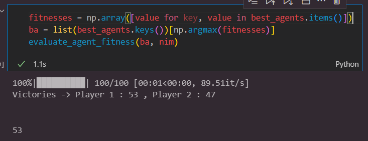

# Lab 2 : Nim Game

The goal of this lab is to create agents able to play efficiently the Nim Game, using both rule-based and evolutionary strategies.

## 1. Rule-based agent

This version is based on a demonstrated mathematic strategy, which is to always play moves with a nim-sum $\neq$ 0 in order to not be the last to pick up a stick. The nim-sum is the sum of an XOR applied on every line of the game, coded with 1 as sticks and 0 as nothing.

*Optimal :* The initial rule-based strategy, as proposed in the template. The idea is to see for each move possible the ones that have a nim-sum $\neq$ 0, and to choose randomly one of them.

*Optimal_rule_based1 :* The strategy mentioned above can be improved, because in the good moves a player can make, there are some better than others, especially if we consider that the opponent will try to make the best moves as well. This strategy takes the basis idea of the first one, but for each good move one can do, the analysis function is called once again to compute what good moves the opponent could do after. If there exists a good move that lets no good moves to the opponent, then it's considered to be the best one we can play.
When opposed to the optimal strategy, this strategy is usually 5 times more efficient than the first one.

*Optimal_rule_based2 :* This strategy takes the previous one as basis, except in this case, whether there exists a best move or not among the good ones, we always choose the move that lets to the opponent the smallest number of good moves. This improvement doesn't make this strategy better than the last one, but it is expected to be more efficient against agents playing randomly, as they are less likely to choose a good move if their number of possible good moves is low.

*Optimal_rule_based3 :* Here we start again from the previous strategy, but this time we always choose the move that lets the less good moves to the opponent, even if there are no moves with a nim-sum $\neq$ 0. Once again, this is to improve efficiency against random strategies.

This strategy is not absolutely optimal, because it would be even more efficient if it computed not only one move, but the whole game in advance. However, such a strategy would require exponential computation time, and couldn't be implemented in reasonable time. Hence, for practical reasons, the optimal_rule_based3 strategy will be considered as the best possible strategy in the next steps.

## 2. Evolutionary agent

The evolutionary agent is supposed to be based on a set of rules and actions that have evolved to maximize a fitness, which is the win rate when put against an optimal rule-based strategy. As the strategies are compared through 100 games, the goal is to reach a fitness of 50 against an optimal strategy.

*Evolutionary_Agent1 :* This first class is the basis of the evolutionary agent, with a very small set of arbitrary rules, whose thresholds and subsequent actions can evolve. The mutations of those rules is made using Gaussian mutations with fixed variances. Once mutated, all the numbers involved are transformed back into int, as the rules don't need floating points thresholds, and the actions involve two integers. An additional check is also made to prevent those values from going out of the valid range given by a specific nim state (for example, a mutation can't result in a rule with an action on a line that doesn't exist in the nim state).
This very simple agent was designed to begin with the evolutionary strategies, and is very unefficient, (it has a fitness lesser than 10 against optimal, and 0 against optimal_rule_based3) because of the number of rules he can change. In the following models, we will focus on these rules.

*Evolutionary_Agent2 :* This second agent, based on Evolutionary_Agent1, is given a wider degree of freedom, as it has not only 3 rules, but 100. Each rule's expression is generated randomly at the initialization of the agent, by picking an expression in a predermined set (containing for example expressions like "if number of rows with at least 1 stick > X, then ..."). This set was implemented by hand, with no specific conditions on the expressions, only the intuition that they might be efficient. When evolving this agent, we get much higher results : the evolved individual's fitness varies from 20 to 30 against both optimal and optimal_rule_based3 strategies after only 100 mutations.

*Population :* Evolutionary_Agent2 is a big improvement with respect to Evolutionary_Agent1, and this with very few evolutions. A way to improve even more its results is to not only increase the number of generations, but also to increase the initial number of agents. Indeed, an agent is highly dependent on its rule's expressions, which are fixed on initialization. So if it has bad rules, changing thresholds and actions won't change much the final outcome. The Population class has been created to automatically generate and iterate over a given number of evolutionary agents, which all evolve using different rules. Hence, the variety of genotypes among individuals and generations is much larger than before.
Testing this class has shown that using a population rather than a single agent is much more effective : with an initial population of 20 agents, who each go through ten generations with ten mutations per generation, the best evolved agent has a win rate varying between 45 and 55% against optimal_rule_based3 strategy, which means the goal has been reached.

However, this took a lot of computation time, which can grow with the size of the Nim game. Further improvement would require many optimizations both on evolutionary and optimal sides in order to be tested in reasonable time.

## 3. Possible evolutions

To improve this code, a few options can be explored, under the condition of a big computation time optimization :

* The optimal rule-based strategy could be improved by analysing more than one opponent's move in advance
* Evolutionary agents could use adaptive mutation steps, based on the number of improvements in the last mutations
* Rules' expressions could be more general than hand written rules. For example, genetic programming could be used to generate random expressions from basic components, and make them evolve with each generation
* Giving the evolutionary strategy even more generations and/or an even greater initial population would likely result in an even better agent, able to defeat the absolute optimal strategy around 50% of the times

All those improvements are not implemented yet because time runs too fast, but they might be added later, with some more knowledge on problem-solving methods.
